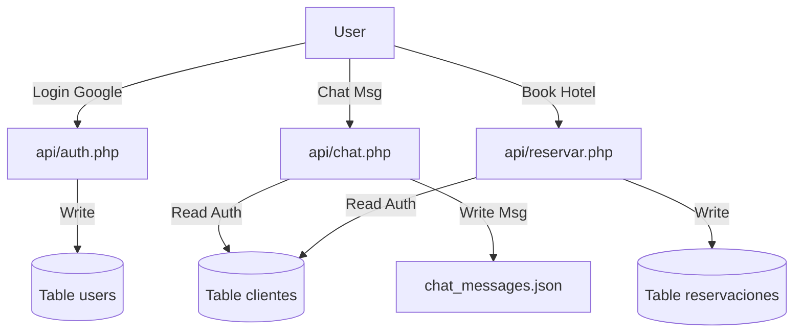

# 🏗️ Análisis de Arquitectura del Sistema - Candelaria 2026

Este documento detalla el funcionamiento interno de la plataforma, el flujo de datos y una **hallazgo crítico** sobre la coexistencia de dos sistemas de identidad.

---

## 1. Autenticación (El "Cisma" de Identidad)

El análisis del código revela que existen **dos sistemas de autenticación paralelos** que actualmente no están sincronizados.

### Sistema A: Moderno / Social (`users`)
Este es el sistema que ves en el modal de "Iniciar Sesión" (Google/Facebook/Email).
*   **Archivos**: `api/auth.php`, `api/auth_email.php`, `includes/auth-header.php`.
*   **Base de Datos**: Tabla `users`.
*   **Mecanismo**: 
    *   Usa **PHP Sessions** (`$_SESSION['user_id']`).
    *   Pensado para funcionalidades nuevas como el perfil de usuario.

### Sistema B: Legacy / Funcional (`clientes`)
Este es el sistema que utilizan las funciones críticas de negocio (Chat y Reservas).
*   **Archivos**: `api/clientes.php`, `api/chat.php`, `api/reservar.php`.
*   **Base de Datos**: Tabla `clientes`.
*   **Mecanismo**:
    *   Usa **Tokens Bearer** Custom (`base64_encode(id:time:random)`).
    *   Validación estricta contra la tabla `clientes`.

### ⚠️ El Problema Crítico
Cuando un usuario se loguea con Google (Sistema A), se crea un registro en `users`. Sin embargo, si intenta reservar un hotel o enviar un mensaje al chat (que usan el Sistema B), **la operación fallará** porque esos endpoints buscan al usuario en la tabla `clientes` y esperan un Token que el Sistema A no genera.

**Recomendación**: Es urgente unificar ambos sistemas, migrando la lógica de `chat.php` y `reservar.php` para que usen la tabla `users` y acepten la sesión/token del nuevo sistema.

---

## 2. Base de Datos en Profundidad

### Diagrama de Flujo de Datos


### Tablas Principales
*   **`users`**: Centralización futura. Contiene `oauth_provider` para diferenciar Google/FB/Email.
*   **`clientes`**: (Legacy) Información de contacto (teléfono) necesaria para reservas.
*   **`hospedajes`**: Catálogo de hoteles.
    *   Columna `servicios`: JSON array (`["wifi", "cochera"]`).
    *   Columna `imagenes`: JSON array de URLs.
*   **`habitaciones`**: Inventario de cada hotel.
    *   Relación `hospedaje_id` -> `hospedajes(id)`.
*   **`reservaciones`**: Transacciones.
    *   Relación `cliente_id` -> `clientes(id)`. **NOTA**: Apunta a `clientes`, no `users`.

---

## 3. Chat en Tiempo Real (`live-platform`)

El chat no utiliza WebSockets reales (como Socket.io) para mantener la compatibilidad con servidores PHP compartidos básicos.

### Funcionamiento (Long Polling)
1.  **Backend (`api/chat.php`)**:
    *   No guarda mensajes en MySQL.
    *   Usa archivos planos: `live-platform/data/chat_messages.json` y `viewers.json`.
    *   Esto hace que sea muy rápido de leer pero difícil de escalar a múltiples servidores.
2.  **Frontend (`live-platform/script.js`)**:
    *   Función `pollMessages()` hace un `GET` cada 2 segundos.
    *   Envía `last_id` para pedir solo mensajes nuevos.
3.  **Seguridad**:
    *   Intenta validar token Bearer contra tabla `clientes`.

---

## 4. Sistema de Hoteles y Reservas (`servicios`)

### Lógica de Negocio
Este módulo es transaccional y maneja dinero/compromiso, por lo que es más estricto.

1.  **Listado (`api/hospedaje.php`)**:
    *   Simplemente vuelca la tabla `hospedajes` en JSON.
    *   El filtrado de precios/calificación ocurre en el **Frontend** (Javascript), no en la consulta SQL. Esto es rápido para <1000 hoteles, pero ineficiente para grandes volúmenes.

2.  **Disponibilidad (`api/disponibilidad.php`)**:
    *   Calcula disponibilidad dinámicamente.
    *   `Disponibles = Total - (Reservas activas en ese rango de fechas)`.
    *   Usa lógica compleja de solapamiento de fechas SQL:
        ```sql
        (r.fecha_entrada < :salida AND r.fecha_salida > :entrada)
        ```

3.  **Reserva (`api/reservar.php`)**:
    *   **Race Condition Check**: Antes de insertar, vuelve a verificar si hay habitación disponible (por si dos usuarios reservaron al mismo milisegundo).
    *   Inserta en `reservaciones` con estado `pendiente`.

---

## 5. Conclusiones

La plataforma tiene una base sólida en cuanto a estructura de archivos y separación de responsabilidades, pero sufre de una deuda técnica en la capa de identidad.

### Próximos Pasos Sugeridos
1.  **Migrar Clientes a Users**: Mover los datos de `clientes` a `users` y añadir columnas faltantes (teléfono, password hash legacy).
2.  **Actualizar Endpoints**: Modificar `api/chat.php` y `api/reservar.php` para que busquen en `users` en lugar de `clientes`.
3.  **Unificar Tokens**: Decidir si usar PHP Session (cookies) o Tokens Bearer (JWT) para todo, y no una mezcla.
